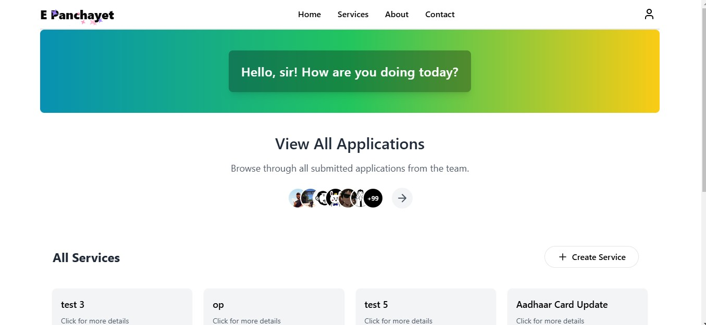
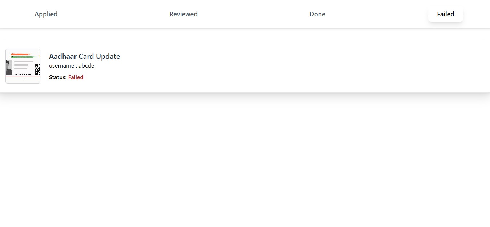
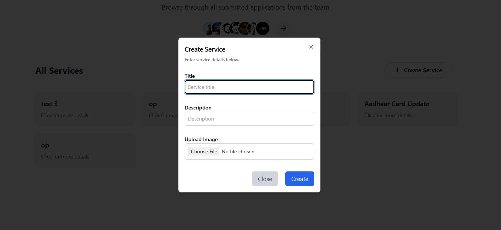
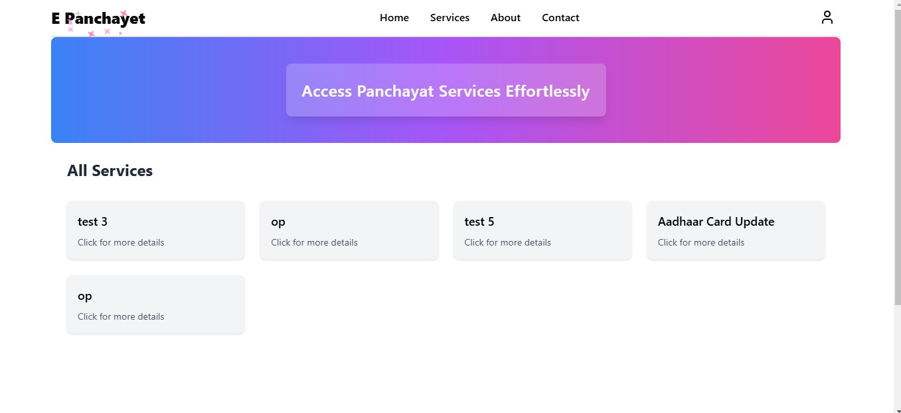
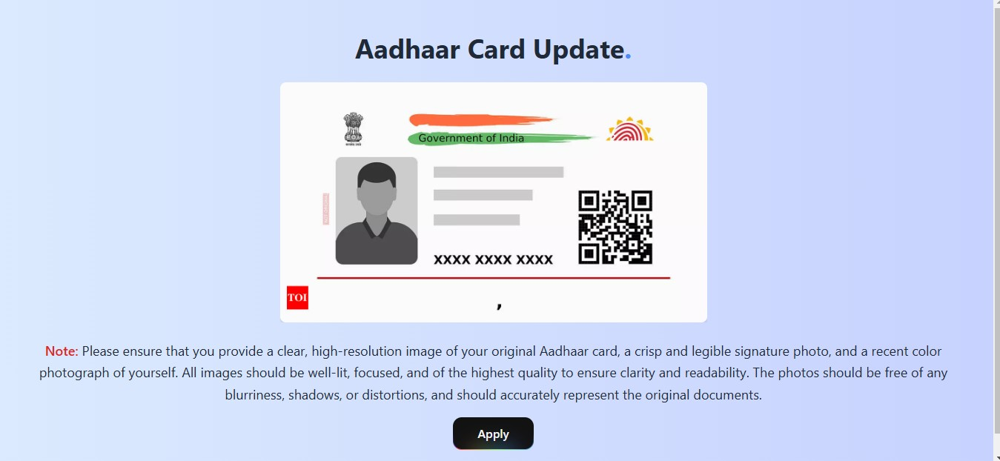
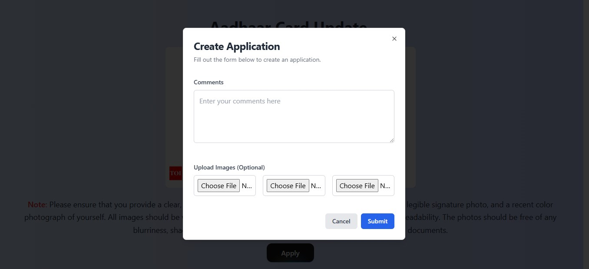

# Digital Panchayet
- [Demo](https://e-gram-panchayet-frontend-j4io.vercel.app/home)
## User and Officer Roles

- **Officer Landing Page**: Officers have a different landing page with additional functionalities.
- **Service Creation**: Only officers can create new services.
- **Application Submission**: Users can only apply for services; they cannot create them.
- **Privacy**: Users cannot see applications submitted by other users.
Digital Panchayet is a web application that allows users to apply for various services provided by the Panchayet. Officers and staff can update the status of these applications, such as "Done", "Failed", or "In Progress".

## Features

- **User Services**: Users can apply for different services online.
- **Status Updates**: Officers and staff can update the status of applications.
- **User Interface**: Intuitive and user-friendly interface for easy navigation.

## Screenshots

### Officer landing page

### Officer All Application Page

### Officer Service Creation

### User Landing page

### User Apply Page

### User Apply section


## Backend

The backend of this project is available at the following link:

[Digital Panchayet Backend](https://github.com/Rupam-Mondal/E-Gram-Panchayet-Backend)

## Installation

1. Clone the repository:
    ```bash
    git clone https://github.com/Rupam-Mondal/E-Gram-Panchayet-Frontend
    ```
2. Navigate to the project directory:
    ```bash
    cd digital-panchayet-frontend
    ```
3. Install dependencies:
    ```bash
    npm install
    ```
4. Start the development server:
    ```bash
    npm run dev
    ```

## Contributing

Contributions are welcome! Please fork the repository and submit a pull request.
